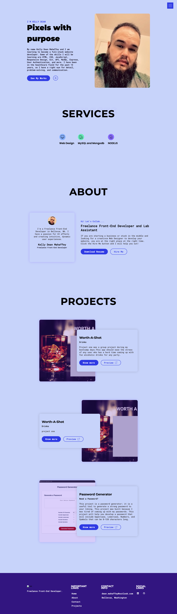
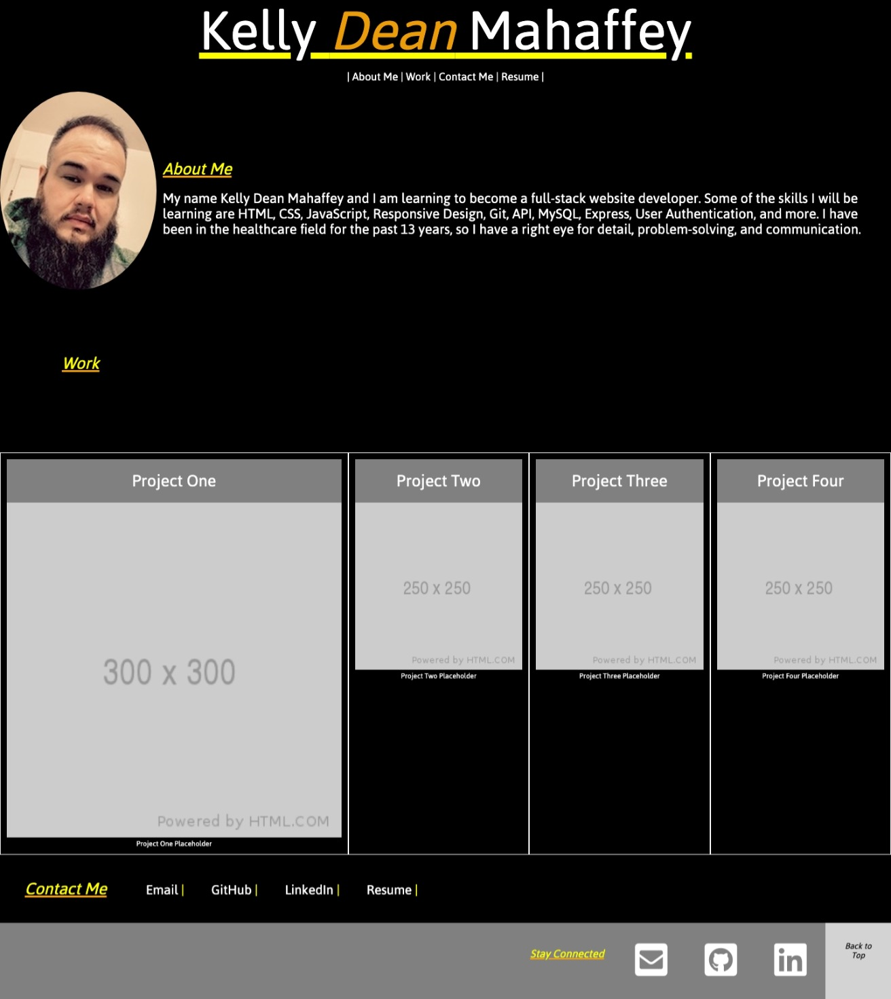

# portfolio v.2

This project is a portfolio website version two to show off some of the projects I will be working on and creating. 
I build this portfolio with only HTML, CSS, and JavaScript to start showcasing some of my works. From this project, 
I learned that CSS is complicated, and sometimes it can be easy. I knew that it takes dedication to create 
and build a website; it just doesn't happen overnight.

# usage

Click the link to my portfolio <https://deanmahaffey.github.io/new-portfolio/>

# portfolio v.2

# portfolio v.1

